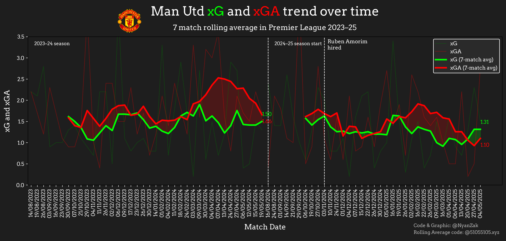

# Rolling xG and xGA Comparison Over Two Seasons

## Overview

The notebook fetches match-by-match xG and xGA data from FBref.com and plots both raw and rolling average values to highlight performance trends. This can help identify shifts in attacking and defensive performance over time, particularly useful for assessing tactical changes or managerial impact.

## Features

- Two-season comparison (e.g., 2023–24 and 2024–25)
- Rolling average of xG and xGA with a configurable window
- Annotated key events (e.g., managerial changes)
- Custom team logo and font support
- Highlighted periods of xG > xGA and vice versa

## Getting Started

### Prerequisites

- Python 3.8+
- `pandas`
- `matplotlib`
- `highlight_text`
- `requests`

Install missing packages via pip:

```bash
pip install pandas matplotlib highlight_text requests
```

## Configuration

You can easily adapt this notebook for any team by changing the following variables at the top of the script:

```python
teamname = "Man Utd"  # Used for file paths and labels
leaguename = "Premier League"
season_2324 = "2023-2024"
season_2425 = "2024-2025"
rollingavg = 7  # Rolling average window
```

You will also need:

- Match log URLs for both seasons from FBref.com
- Local paths for:
  - A team logo image (PNG)
  - A font file (e.g., Arvo-Regular.ttf)

## Output

The script produces a PNG visualization showing:

- Match-by-match xG and xGA
- Rolling average trends
- Highlighted areas where xG exceeds xGA (green) or xGA exceeds xG (red)
- Season transitions and optional annotations (e.g., managerial changes)

## Example Output
Here is an example of the plot generated by the notebook:



## Attribution

Rolling average visualization technique inspired by [@51055105.xyz](https://bsky.app/profile/51055105.xyz).

---

**Note:** This notebook uses Manchester United as an example, but can be adapted to any team by changing the input variables and URLs.
